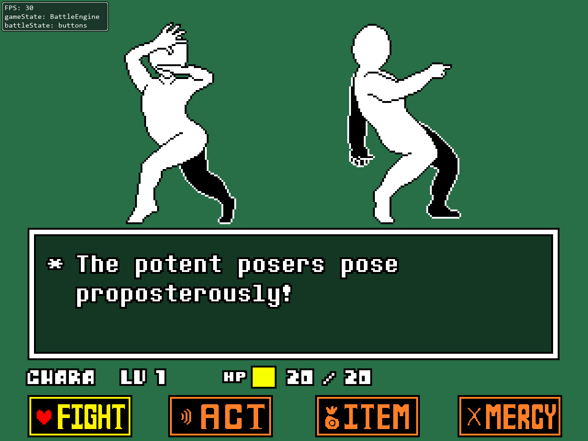
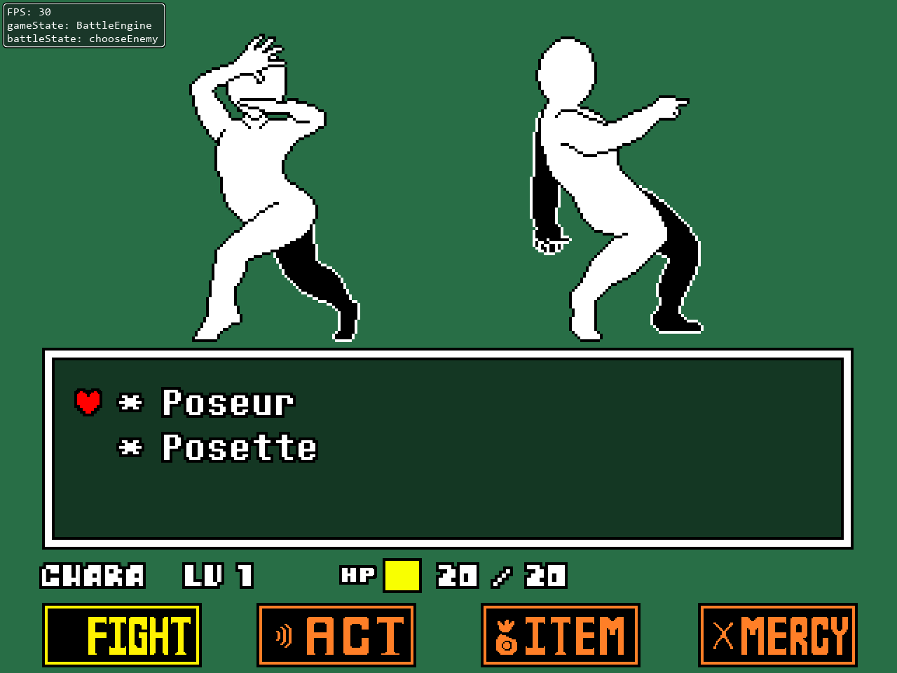
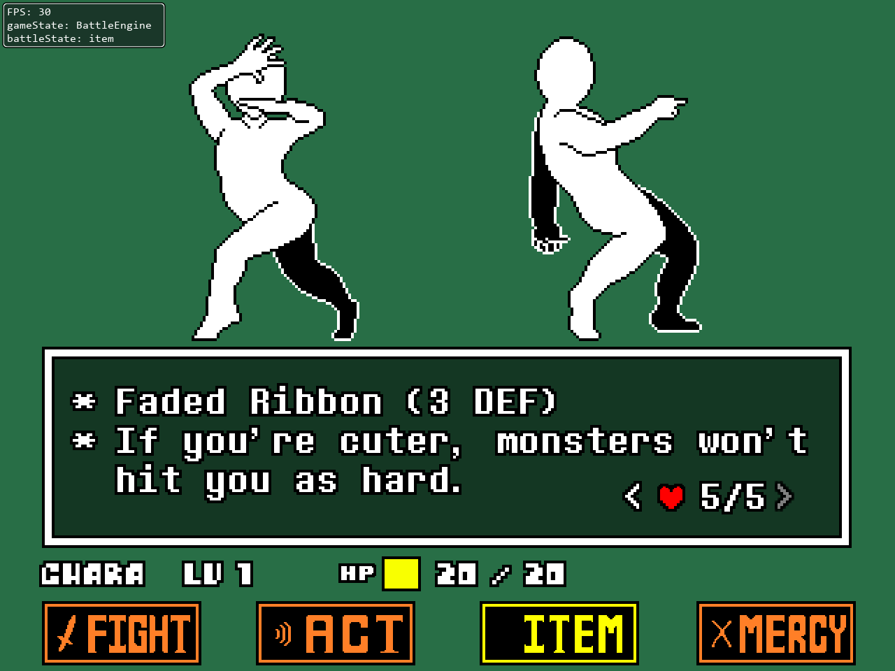
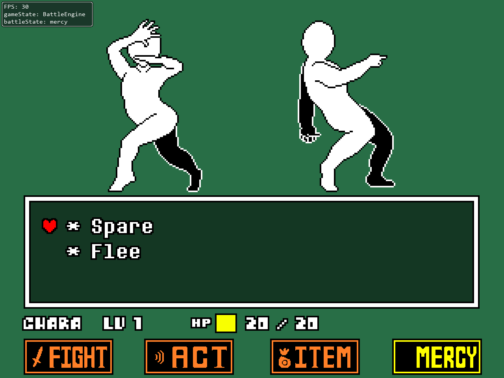
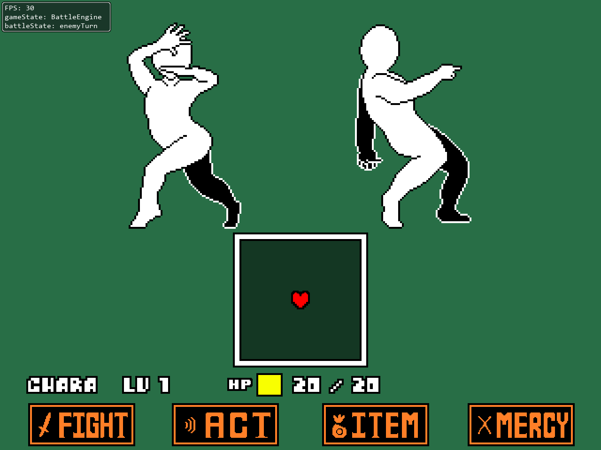
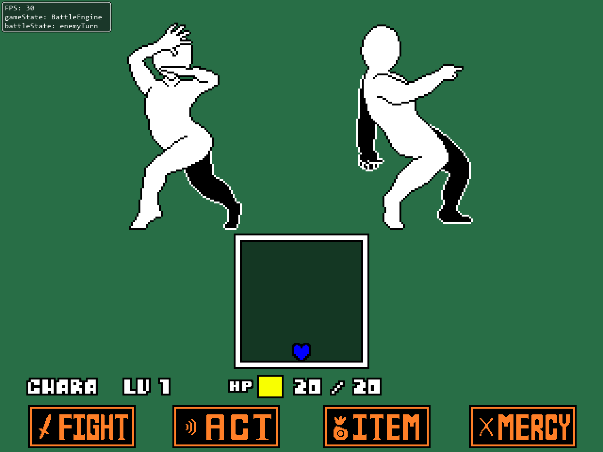

# UNDERLÖVE Engine

UNDERLÖVE is an UNDERTALE engine made with the LÖVE2D game framework. This is a remake of my previous engine, being remade entirely from scratch to put development convinience over accuracy. This is very much a work in progress still but I decided to make this repository public in case anyone wanted to see the engine remake's development.

# Table of Contents
[Engine Screenshots](https://github.com/bradensMG/underlove?tab=readme-ov-file#Engine-Screenshots)  
[Credits](https://github.com/bradensMG/underlove?tab=readme-ov-file#Credits)  

# Engine Screenshots

# Credits
[bradensmediocregames](https://github.com/bradensMG/) - Programmer.  
[RhenaudTheLukark](https://github.com/RhenaudTheLukark) - Creator of CYF, where the Poseur and Posette sprites come from. 
[Davidobot's post on the LOVE2D forums](https://love2d.org/forums/viewtopic.php?p=199030&sid=5e50e42e22e4538ca0f3f7b0717aa2f2#p199030) - FPS Limiter.  
[Toby Fox](https://x.com/tobyfox) - Developer of UNDERTALE, also the composer of Rude Buster.  
[Temmie Chang](https://x.com/tuyoki) - Developer of UNDERTALE.  

This engine is developed for fun, you're more than welcome to use or make modifications to it! It's still very unfinished right now, but hopefully soon it'll be in a state that it can be useful to people!
