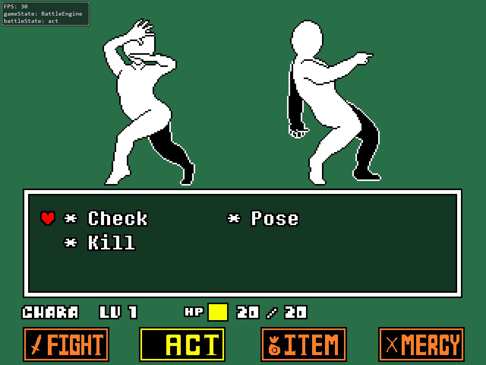

# Overworld Engine
[Overworld Engine](https://github.com/bradensMG/underlove-overworld)

Not much is done for it, but I decided to make the repository public anyway.

# UNDERLÖVE Engine

UNDERLÖVE is a UNDERTALE engine made with the LÖVE2D game framework. This is a remake of my previous engine, being remade entirely from scratch to put development convenience over accuracy. This is still a work in progress, but I decided to make this repository public in case anyone wanted to see the engine remake's development.

# Table of Contents
[Engine Screenshots](https://github.com/bradensMG/underlove?tab=readme-ov-file#Engine-Screenshots)  
[Credits](https://github.com/bradensMG/underlove?tab=readme-ov-file#Credits)  

# Engine Screenshots

# Credits
[bradensmediocregames](https://github.com/bradensMG/) - Programmer.  
[RhenaudTheLukark](https://github.com/RhenaudTheLukark) - Creator of CYF, where the Poseur and Posette sprites come from. 
[Davidobot's post on the LOVE2D forums](https://love2d.org/forums/viewtopic.php?p=199030&sid=5e50e42e22e4538ca0f3f7b0717aa2f2#p199030) - FPS Limiter.  
[Toby Fox](https://x.com/tobyfox) - Developer of UNDERTALE, also the composer of Rude Buster.  
[Temmie Chang](https://x.com/tuyoki) - Developer of UNDERTALE.  

#

This engine is developed for fun, you're more than welcome to use or modify it! It's still unfinished right now, but hopefully, it'll be in a state where it can be useful to people!

