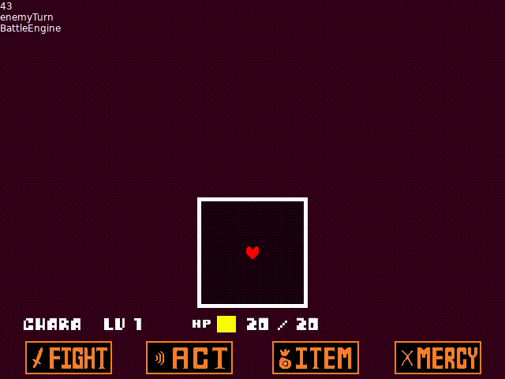

# UNDERLÖVE Engine

UNDERLÖVE is an UNDERTALE engine made with the LÖVE2D game framework. This is a remake of my previous engine, being remade entirely from scratch to put development convinience over accuracy.

# Engine Screenshots

# Credits

[bradensmediocregames](https://github.com/bradensMG/) - Main developer. i programmed like everything

[Toby Fox](https://x.com/tobyfox) - Developer of UNDERTALE

[Temmie Chang](https://x.com/tuyoki) - Developer of UNDERTALE
